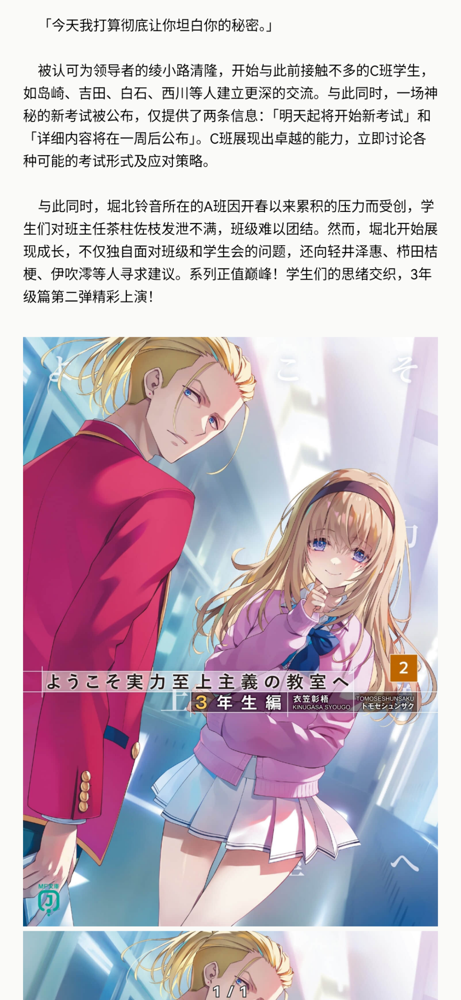
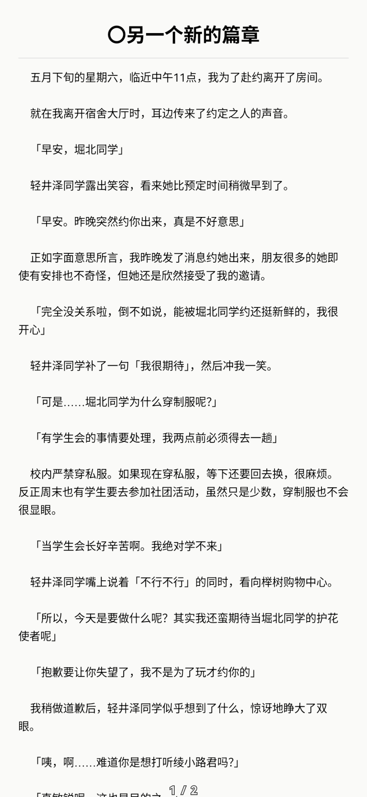

## 说明 

这是一个适用于 Mihon/Tachiyomi 及其分支，用于阅读**哔哩轻小说**的插件，使用 `TextInterceptor` 将文本转成图片显示

***因为一页的文本量较大，强烈建议使用使用“条漫”模式观看***

## 用法

**使用仓库更新地址**

```
https://raw.githubusercontent.com/hualiong/bilinovel-extension/main/index.min.json
```

若无法成功，请去 [Releases](https://github.com/hualiong/bilinovel-extension/releases) 下载 APK 安装

## 截图
<div style="display: flex; justify-content: space-evenly;">
  
  
</div>

## 更新日志

### [1.4.6] - 2025-09-11
- 添加深色模式设置，可一键切换阅读页面颜色样式
- 设置中修改颜色样式时，添加额外提示

### [1.4.5] - 2025-08-29
- 更新密钥

### [1.4.4] - 2025-08-23
- 使用 markdown 样式在简介里显示别名
- 添加关于颜色的配置（阅读背景颜色，阅读字体颜色）
- 修复在观看一些已下架小说时的异常图片显示

### [1.4.3] - 2025-08-22
- 支持小说文本中显示插图
- 添加每章标题，并微调间距

### [1.4.2] - 2025-08-19
- 支持更多筛选条件（文库地区、作品主题、排序方式、是否动画、作品字数、写作状态）

### [1.4.1] - 2025-08-14
- 支持查看搜索，热门，最近更新
- 支持阅读小说（暂不支持查看插图，后续更新或许会支持）
- 支持在设置里切换“热门”一栏要显示的内容（可选择各种排行榜）
- 添加限流设置（10秒内仅限10个请求，尽量不要频繁用下载功能，容易失败，对源站也有压力）