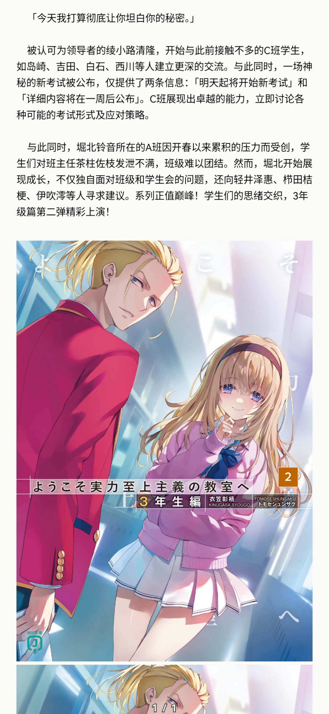
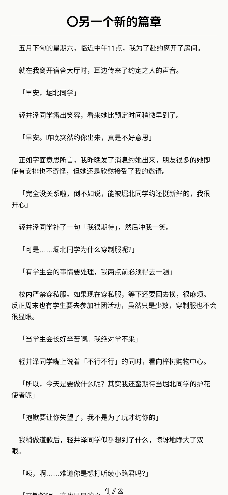

## 说明 

这是一个适用于 Mihon/Tachiyomi 及其分支，用于阅读**哔哩轻小说**的插件，使用 `TextInterceptor` 将文本转成图片显示

### 一些提醒：

- *因为一页的文本量较大，强烈建议使用“**条漫**”模式观看*

- *尽量不要改 mihon 的默认UA标识，要改也要用移动端标识，否则插件将连接到 [PC 端网站](https://www.linovelib.com)，无法正常获取内容*

## 用法

**使用仓库更新地址**

```
https://raw.githubusercontent.com/hualiong/bilinovel-extension/main/index.min.json
```

若无法成功，请去 [Releases](https://github.com/hualiong/bilinovel-extension/releases) 下载 APK 安装

## 截图
<div style="display: flex; justify-content: space-evenly;">
  
  
</div>

## 更新日志

### [1.4.15] - 2026-03-27
- 将请求插图的方式从线程池替换为协程
- 作品详细页添加插画师信息
- 作品简介现在默认会显示公告通知（如果有），可在设置中关闭
- 减小作品简介文本间的行间距，现在会更加紧凑

### [1.4.14] - 2026-03-16
- 修复小说乱序

### [1.4.13] - 2026-03-05
- 分别合并阅读页颜色和字号的设置项
- 支持源站的“标记书签”功能，可在设置中开启，**但必需在 WebView 中登录账号**。
  - 开启后，每当读到新章节的第一页，就会自动调用源站的 API 标记该章节为书签（注：无论该章节是否已读，只要加载了第一页，就会调用接口标记书签）
  - 你可以在源站的「用户中心 - 我的书架」上查看标记情况，一旦添加书签就会自动将该小说加入书架。
  - 简单说，就类似于 Mihon 的进度记录，只不过是把源站当作记录平台，并且不是读完了才记录，而是读到了就记录

### [1.4.12] - 2026-02-22
- 添加自定义限流设置

### [1.4.11] - 2025-12-22
- 修复一些小说没有分卷导致获取不到章节的Bug

### [1.4.10] - 2025-12-13
- 修复一些章节会显示其它章节内容的Bug

### [1.4.9] - 2025-11-26
- 修复一些Bug

### [1.4.8] - 2025-10-02
- 尝试修复小说乱序

### [1.4.7] - 2025-09-19
- 添加繁体显示开关
- 添加自定义字号大小设置

### [1.4.6] - 2025-09-11
- 添加深色模式设置，可一键切换阅读页面颜色样式
- 设置中修改颜色样式时，添加额外提示

### [1.4.5] - 2025-08-29
- 更新密钥

### [1.4.4] - 2025-08-23
- 使用 markdown 样式在简介里显示别名
- 添加关于颜色的配置（阅读背景颜色，阅读字体颜色）
- 修复在观看一些已下架小说时的异常图片显示

### [1.4.3] - 2025-08-22
- 支持小说文本中显示插图
- 添加每章标题，并微调间距

### [1.4.2] - 2025-08-19
- 支持更多筛选条件（文库地区、作品主题、排序方式、是否动画、作品字数、写作状态）

### [1.4.1] - 2025-08-14
- 支持查看搜索，热门，最近更新
- 支持阅读小说（暂不支持查看插图，后续更新或许会支持）
- 支持在设置里切换“热门”一栏要显示的内容（可选择各种排行榜）
- 添加限流设置（10秒内仅限10个请求，尽量不要频繁用下载功能，容易失败，对源站也有压力）